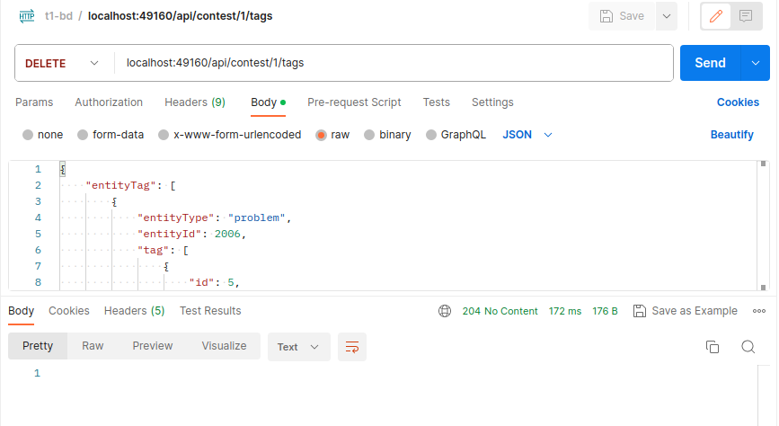

# Trabalho 1 Banco de Dados

* Autor: Christian Junji Litzinger State (junjao.ccomp@gmail.com)
* Professor: Rodrigo Laiola Guimarães

## Pré-requisitos
Este sistema foi testado apenas sobre a versão do Ubuntu 22.04 LTS e, portanto, seu funcionamento não é garantido para outros SOs e versões.

A seguir estão listados os pré-requisitos de software utilizados para teste e produção do mesmo.

* Docker: 24.x
* Git: 2.34.x

## Quick-Start

Uma vez instalados os pré-requistos, basta inicialmente clonar o repositório do git em algum diretório de sua preferência:

```bash
git clone https://github.com/junji-code/boca-docker.git
```

Uma vez clonado, na pasta raiz do repositório executar o seguinte comando para executar os contêineres e iniciar o sistema:

```bash
sudo docker compose -f docker-compose.yml -f docker-compose.prod.yml -f docker-compose.api.yml up -d --build
```

Simples assim! Agora você consegue acessar, pelo seu navegador de preferência, o Adminer para visualizar as mudanças no banco pelo endereço http://localhost:8080 e logar com as credenciais:

* Sistema: Postgres
* Servidor: boca-db
* Usuário: postgres
* Senha superpass
* Base de dados: bocadb

Para se comunicar com a API de tags basta enviar requisições no padrão especificado pelas especificações do trabalho, enviando as requisições para o endereço http://localhost:49160/.

*É importante destacar que caso o Adminer esteja logado com as credenciais informadas, pode acontecer da conexão com o banco ser rejeitada pela API, tendo em vista que as mesmas credenciais são utilizadas pela API para se comunicar com o banco de dados*

E para encerrar o sistema basta executar o comando

```bash
sudo docker compose -f docker-compose.yml -f docker-compose.prod.yml -f docker-compose.api.yml down --volumes
```

## Modelagem

Para modelagem do banco para adicionar a funcionalidade de tags, escolheu-se criar 4 tabelas associativas, uma para cada entidade, e uma tabela para armazenagem de tags. Como ilustra a imagem a seguir:


Na tabela de tags, optou-se por utilizar tanto o ID da tag como o contestnumber como chaves primárias por motivos de usabilidade, já que se isso não fosse feito, alterar uma tag com um ID específico em um contest afetaria a tag sendo utilizada em outro contest.

Essa escolha faz com que possam existir várias tuplas praticamente iguais, alterando apenas o contest a que fazem parte. Entretanto, esse custo foi julgado como necessário para o bom uso e funcionamento do sistema. Porém duas tags que participam do mesmo contest ainda podem ser afetadas por mudanças se, por exemplo, uma mesma tag estiver atribuída à duas entidades diferentes e decidir-se alterá-la para uma das entidades, o restante das entidades do mesmo contest que tiverem essa tag atribuída também serão afetadas pela mudança.

A deleção de tags foi considerada apenas para efeitos da tabela associativa, isto é, deletar uma tag de uma entidade é na verdade deletar o relacionamento entre ambas, porém caso a deleção de um relacionamento faça com que nenhuma entidade se relacione com aquela tag, então o sistema automaticamente exclui a tag do banco.

A escolha de utilizar apenas uma tabela para as tags também afeta o desempenho da requisição de POST, já que para toda nova tag atribuída deve-se verificar se já não há outra com o mesmo ID e valores diferentes para que não seja gerado conflito e levante uma exceção do SGBD, entretanto este custo pôde ser minimizado com a utilização de índices hash para a tabela tag em cima do seu atributo "tagid".

Quanto às tabelas associativas, viu-se a necessidade de criar uma para cada entidade tendo em vista que:

1. A relação entre as tags e entidades é uma relação m:n o que, pelas regras de modelagem, exige a criação de uma nova tabela para representar o relacionamento.
2. Cada tipo de entidade tem uma tabela específica e, portanto, pode acontecer de duas entidades diferentes terem o mesmo ID, e como o ID da entidade faz parte da chave primária na tabela associativa, poderia ocorrer de termos chaves primárias idênticas na tabela, o que acarretaria em um erro.

Suas chaves primárias são compostas pelas chaves primárias das tabelas das quais ela se relaciona.

### Outros desafios

Cogitou-se como forma de tornar as tags completamente independentes, utilizar as chaves primárias das entidades como chaves primárias das tags, colapsando-as com as tabelas associativas, porém optou-se por não seguir esse caminho porque geraria muito despedício de memória pro caso de uma mesma tag ser atribuída à varias entidades diferentes, cuja frequência imaginou-se ser considerável. Portanto decidiu-se descartar esta ideia.

### Eficiência da modelagem
Acredita-se que a modelagem proposta segue os padrões de normalização. As tabelas estão na 1FN já que não há tabelas aninhadas. Também estão na 2FN, já que teoricamente os atributos das tags (name e value) não dependem do seu ID ou do ID do seu contest e nas tabelas associativas todos os atributos são atributos chave. E estão na 3FN tendo em vista que na tabela tag os atributos não-chave, que poderiam gerar alguma dependência transitiva, não possuem dependência de um para o outro.

Portanto, dentro do que foi abordado e cobrado na disciplina não há otimizações a serem feitas para eliminar redundâncias.

### Possíveis melhorias
O código implementado faz muitas verificações antes de executar alguma inserção/atualização/deleção de tags, utilizando consultas excessivas para tal o que pode fazer com que as requisições à API fiquem mais lentas com o crescimento de dados do banco.

Isso foi feito dessa maneira para remover a responsabilidade do banco de verificar esses detalhes e evitar o lançamento de exceções no código. Entretanto, pode-se buscar compreender melhor as exceções lançadas pelo SGBD e utilizá-las para tornar as verificações menos custosas.

## Testes

Todos os testes foram executados manualmente com o auxílio da ferramenta Postman para Ubuntu. Portanto, não foram escritos testes automatizados para a API.

A seguir estão listados alguns que foram executados:

* Tentativa de POST em tags com IDs existentes porém com name e value diferentes:


* Deletar todas as tags criadas:


* Get no tipo de entidade 'site/user':


* Put em tags existentes
